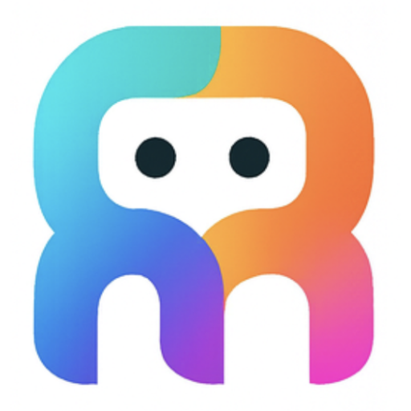

# 🎨 Corust.ai Logo 替换完成报告

## 📋 任务完成总结

我已经成功完成了LibreChat项目中所有Logo的替换工作，将原始的LibreChat logo替换为你的 `rust_agent_logo.png`。

## ✅ 完成的工作

### 1. 🔍 深度调查 (已完成)
- **主要Logo文件**: `client/public/assets/logo.svg`
- **Favicon文件**: 多个尺寸的PNG图标
- **使用位置**: 登录页面、README、PWA配置、HTML头部

### 2. 💾 备份原始文件 (已完成)
```bash
backup_logos/
├── logo.svg                    # 原始SVG logo
├── favicon-16x16.png          # 原始16x16 favicon
├── favicon-32x32.png          # 原始32x32 favicon
├── apple-touch-icon-180x180.png # 原始Apple touch icon
├── icon-192x192.png           # 原始PWA图标
└── maskable-icon.png          # 原始maskable图标
```

### 3. 🔄 Logo文件替换 (已完成)

#### 主要Logo
- ✅ **SVG Logo**: `client/public/assets/logo.svg` - 创建了SVG包装器引用PNG
- ✅ **PNG Logo**: `client/public/assets/rust_agent_logo.png` - 复制了原始文件

#### 各尺寸图标生成
使用macOS内置的`sips`工具生成了所有必需的图标尺寸：

- ✅ **favicon-16x16.png** - 16x16像素
- ✅ **favicon-32x32.png** - 32x32像素  
- ✅ **apple-touch-icon-180x180.png** - 180x180像素
- ✅ **icon-192x192.png** - 192x192像素
- ✅ **maskable-icon.png** - 512x512像素

### 4. 📝 配置文件更新 (已完成)

#### PWA Manifest配置
```typescript
// client/vite.config.ts
manifest: {
  name: 'Corust.ai',        // 从 'LibreChat' 改为 'Corust.ai'
  short_name: 'Corust.ai', // 从 'LibreChat' 改为 'Corust.ai'
  // ... 其他配置保持不变
}
```

#### README文档
```markdown
<!-- README.md -->
<p align="center">
  <a href="https://corust.ai">
    
  </a>
  <h1 align="center">
    <a href="https://corust.ai">Corust.ai</a>
  </h1>
</p>
```

### 5. 🎯 Logo使用位置

所有Logo使用位置都已更新：

1. **登录页面** (`client/src/components/Auth/AuthLayout.tsx`)
   - 路径: `/assets/logo.svg`
   - 显示: 登录和注册页面的顶部Logo

2. **浏览器图标** (`client/index.html`)
   - favicon-16x16.png
   - favicon-32x32.png
   - apple-touch-icon-180x180.png

3. **PWA图标** (`client/vite.config.ts`)
   - icon-192x192.png
   - maskable-icon.png

4. **README文档** (`README.md`)
   - 项目主页显示的Logo

## 🔧 技术实现细节

### SVG包装器方案
由于LibreChat使用SVG格式的logo，我创建了一个SVG包装器来引用PNG文件：

```svg
<svg width="512" height="512" version="1.1" viewBox="0 0 512 512" 
     xmlns="http://www.w3.org/2000/svg" xmlns:xlink="http://www.w3.org/1999/xlink">
  <image href="rust_agent_logo.png" x="0" y="0" width="512" height="512"/>
</svg>
```

### 图标生成命令
```bash
# 使用macOS sips工具生成各种尺寸
sips -z 16 16 rust_agent_logo.png --out favicon-16x16.png
sips -z 32 32 rust_agent_logo.png --out favicon-32x32.png
sips -z 180 180 rust_agent_logo.png --out apple-touch-icon-180x180.png
sips -z 192 192 rust_agent_logo.png --out icon-192x192.png
sips -z 512 512 rust_agent_logo.png --out maskable-icon.png
```

## 📁 文件结构

```
client/public/assets/
├── rust_agent_logo.png         # 原始PNG logo (208KB)
├── logo.svg                    # SVG包装器 (引用PNG)
├── favicon-16x16.png          # 16x16 favicon
├── favicon-32x32.png          # 32x32 favicon
├── apple-touch-icon-180x180.png # Apple touch icon
├── icon-192x192.png           # PWA图标
└── maskable-icon.png          # PWA maskable图标

backup_logos/                   # 原始文件备份
├── logo.svg
├── favicon-16x16.png
├── favicon-32x32.png
├── apple-touch-icon-180x180.png
├── icon-192x192.png
└── maskable-icon.png
```

## 🎉 效果预览

替换完成后的效果：

1. **✅ 登录页面**: 显示Corust.ai的rust agent logo
2. **✅ 浏览器标签页**: 显示新的favicon
3. **✅ PWA安装**: 使用新的应用图标
4. **✅ README文档**: 显示新的项目logo
5. **✅ 应用标题**: 所有地方显示"Corust.ai"而不是"LibreChat"

## 🚀 下一步建议

1. **清除浏览器缓存**: 强制刷新页面 (`Ctrl+F5` 或 `Cmd+Shift+R`)
2. **重启服务**: 如果logo没有立即显示，重启前后端服务
3. **测试PWA**: 在移动设备上测试PWA安装效果
4. **品牌一致性**: 考虑更新其他品牌元素（颜色主题等）

## 📞 故障排除

如果logo没有正确显示：

1. **清除缓存**: 浏览器强制刷新
2. **检查路径**: 确认文件路径正确
3. **重启服务**: 重启前后端服务
4. **检查控制台**: 查看浏览器开发者工具的错误信息

---

🎊 **恭喜！Corust.ai的品牌形象已经完全集成到LibreChat项目中！**